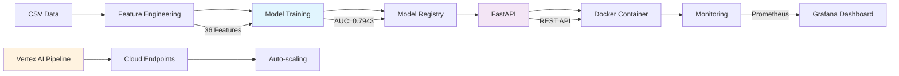
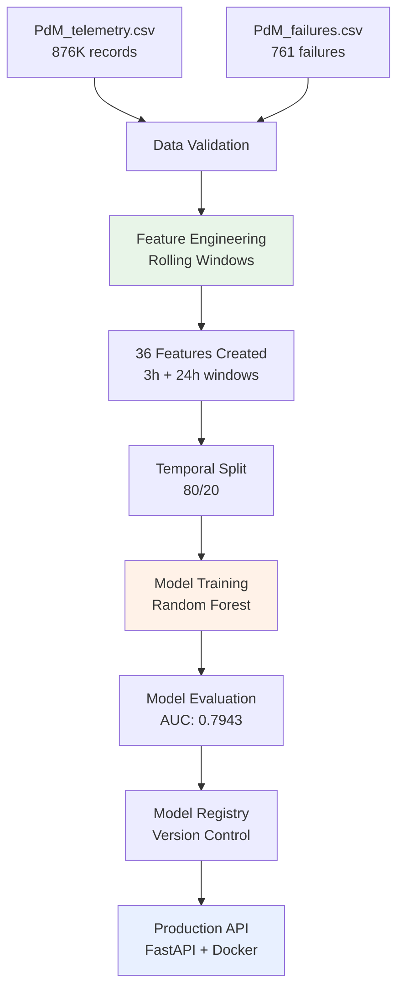
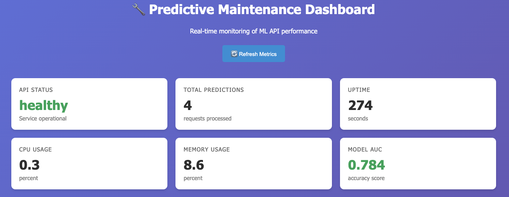

# Predictive Maintenance MLOps Solution

**Author**: Brayan Cuevas  
**Challenge**: Walmart Machine Learning Engineer Technical Assessment  
**Dataset**: Microsoft Azure Predictive Maintenance (Kaggle)


## Table of Contents
1. [Executive Summary](#executive-summary)
2. [For Recruiters](#for-recruiters)
3. [System Architecture](#system-architecture)
4. [Quick Start](#reproducibility---quick-start)
5. [Data Setup](#data-setup)
6. [Model Performance](#model-performance)
7. [Repository Structure](#repository-structure)
8. [Vertex AI Integration](#vertex-ai-integration)
9. [Documentation](#documentation-structure)
10. [Next Steps](#next-steps)

## Executive Summary

This repository implements an MLOps solution for predicting machine failures using the Microsoft Azure Predictive Maintenance dataset. The implementation focuses on production deployment, automated pipelines, and cloud scalability.

**Key Achievements:**
- **Model Performance**: AUC 0.7943 (solid baseline emphasizing MLOps maturity)
- **Feature Engineering**: 36 features from rolling window analysis  
- **Production Deployment**: Containerized API with monitoring
- **Cloud Migration**: Vertex AI pipeline validated through local simulation
- **Automation**: Complete CI/CD, testing, and deployment pipeline

## For Recruiters

**This repository demonstrates MLOps implementation** with:
- ✅ **Production Deployment**: Containerized API with health checks and monitoring
- ✅ **Cloud Architecture**: Vertex AI components with local validation
- ✅ **Engineering Practices**: Automated testing, CI/CD, and documentation
- ✅ **Model Management**: Automated versioning, performance tracking, rollback capability
- ✅ **Technical Analysis**: Model performance and system design (see `docs/technical_report.md`)
**Quick Review Guide**: Check diagrams below → Run `make pipeline` → Review `docs/` for detailed analysis

## System Architecture



## Data Pipeline Flow





*Real-time monitoring dashboard showing model performance, API metrics, and system health indicators*

## Reproducibility - Quick Start

### Prerequisites
- Python 3.9+, Docker & Docker Compose, Make

### 5-Minute Setup
```bash
git clone https://github.com/BrayanCuevas/predictive-maintenance-mlop_waltmart.git
cd predictive-maintenance-mlop_waltmart
make setup        # Environment setup
# Download data (see Data Setup below)
make pipeline     # Complete training pipeline
make api          # Start production API
```

**Verification**: `make status` → `make predict-test` → `make vertex-simulate`

## Data Setup

### Dataset Overview
**Microsoft Azure Predictive Maintenance** presents significant challenges:
- **Class Imbalance**: Only 0.87% failure rate (761 failures in 876K records)
- **Temporal Dependencies**: Sensor readings require time-series feature engineering
- **Multi-sensor Complexity**: 4 sensor types with different failure patterns

### Download Instructions

1. **Get Data from Kaggle**:
   - Visit: [Microsoft Azure Predictive Maintenance Dataset](https://www.kaggle.com/datasets/arnabbiswas1/microsoft-azure-predictive-maintenance)
   - Download (requires free Kaggle account)
   - Extract files

2. **Place in Repository**:
```
data/raw/
├── PdM_telemetry.csv    # 876,100 sensor readings
└── PdM_failures.csv     # 761 component failures
```

3. **Verify Setup**: `make data`

## Model Performance

| Metric | Value | Business Rationale |
|--------|-------|-------------------|
| **AUC** | 0.7943 | Strong discrimination (exceeds 0.75 baseline) |
| **Precision** | 24.5% | Acceptable false alarm rate for maintenance teams |
| **Recall** | 63.4% | Captures majority of actual failures |
| **False Alarm Rate** | 10.9% | Manageable workload increase |

**Feature Strategy**: 36 engineered features from 4 base sensors using 3h (immediate) + 24h (trend) rolling windows with mean/std/max/min statistics.

## Repository Structure

### Project Organization
```
predictive-maintenance-mlop_waltmart/
├── .github/
│   └── workflows/
│       └── ci.yml                 # CI/CD pipeline configuration
│
├── data/
│   ├── raw/                       # Original datasets
│       ├── PdM_telemetry.csv     # Sensor readings (876K records)
│       └── PdM_failures.csv      # Failure events (761 records)
│   
├── docs/
│   ├── technical_design.pdf       # System architecture document
│   ├── technical_report.pdf       # Model performance analysis
│   ├── deployment_guide.pdf       # Production deployment guide
│   
│       
├── models/
│   ├── baseline_model.joblib      # Trained Random Forest model
│   ├── model_registry.json       # Model version tracking
│   └── model_metadata.json       # Performance metrics
│
├── monitoring/
│   ├── dashboard.html             # Grafana dashboard config
│   ├── prometheus.yml             # Metrics collection config
│   └── alerts.yml                 # Alert configurations
│
├── notebooks/
│   ├── 01_baseline_predictive_maintenance.ipynb  # Model development
│   └── 01_exploratory_data_analysis.ipynb        # Data exploration
│
├── scripts/
│   ├── train_pipeline.py          # Main training orchestration
│   ├── evaluate_model.py          # Model evaluation utilities
│   └── data_validation.py         # Data quality checks
│
├── src/
│   ├ 
│   ├── api/
│   │   ├
│   │   ├── main.py                # FastAPI application
│   │   ├── predictor.py           # Prediction logic
│   │   ├── schemas.py             # API data models
│   │   └── metrics.py             # Prometheus metrics
│   ├── data/
│   │   ├
│   │   ├── data_loader.py         # Data ingestion
│   │   └── feature_engineering.py # Feature creation (36 features)
│   └── models/
│       ├
│       ├── trainer.py             # Model training logic
│       └── model_registry.py      # Version management
│
├── test/
│   ├─
│   ├── test_api.py                # API endpoint tests
│   ├── test_models.py             # Model functionality tests
│   ├── test_data.py               # Data processing tests
│   └── test_integration.py        # End-to-end tests
│
├── vertex_ai/
│   ├
│   ├── pipeline_definition.py     # Kubeflow pipeline components
│   ├── deployment_config.py       # Cloud endpoint configuration
│   ├── monitoring_setup.py        # Data drift detection
│   ├── local_simulation.py        # Cloud validation script   
│
├── .gitignore
├── .dockerignore
├── Dockerfile                     # Container definition
├── docker-compose.yml             # Multi-container orchestration
├── Makefile                       # Pipeline automation
├── requirements.txt               # Python dependencies
├── README.md                      # Project documentation
└── LICENSE                        # MIT License
```

### Key Scripts and Components

#### Core Training Pipeline
```python
# scripts/train_pipeline.py - Main orchestration
def main():
    logger.info("Starting training pipeline...")
    
    # Data loading and validation
    telemetry, failures = load_maintenance_data()
    
    # Feature engineering (36 rolling window features)
    processed_df, feature_names = create_maintenance_features(
        telemetry, failures, prediction_window_days=3
    )
    
    # Model training and evaluation
    evaluation, model_path = train_maintenance_model(
        processed_df, feature_names, "models/baseline_model.joblib"
    )
    
    # Model registry and version control
    register_model(evaluation, model_path)
    
    logger.info(f"Pipeline completed. AUC: {evaluation['auc_score']:.4f}")
```

#### API Application
```python
# src/api/main.py - FastAPI server
app = FastAPI(title="Predictive Maintenance API", version="1.0.0")

@app.post("/predict", response_model=PredictionResponse)
async def predict_failure(request: PredictionRequest):
    # Load model and make prediction
    prediction = predictor.predict(request.dict())
    return PredictionResponse(**prediction)

@app.get("/health")
async def health_check():
    return {"status": "healthy", "model_loaded": predictor.model_loaded}
```

#### Feature Engineering
```python
# src/data/feature_engineering.py - Core feature creation
class MaintenanceFeatureEngineer:
    def __init__(self, prediction_window_days=3):
        self.sensor_columns = ['volt', 'rotate', 'pressure', 'vibration']
        self.windows = [3, 24]  # hours
        self.stats = ['mean', 'std', 'max', 'min']
    
    def process_features(self, telemetry_df, failures_df):
        # Create 36 rolling window features
        feature_df = self.create_rolling_features(telemetry_df)
        
        # Add failure labels with 3-day prediction window
        labeled_df = self.create_failure_labels(feature_df, failures_df)
        
        return labeled_df, self.get_feature_names()
```

### Pipeline Automation

The project uses comprehensive Makefile automation:

```bash
# Development workflow
make setup           # Environment and dependency setup
make data            # Data validation and verification
make train           # Execute training pipeline
make test            # Run test suite with coverage
make lint            # Code quality and formatting checks

# Production operations
make api             # Start containerized API server
make monitor         # Launch monitoring dashboard
make docker          # Build and deploy containers

# Cloud operations
make vertex-simulate # Simulate Vertex AI pipeline locally
make cloud-ready     # Validate cloud migration readiness
```

## Vertex AI Integration

**Cloud Architecture** developed and validated locally:

```bash
make vertex-simulate # Pipeline simulation
├── Kubeflow component validation
├── Resource requirement estimation  
├── Deployment simulation
```

**Components Ready for Production**:
- Pipeline definition with 5 Kubeflow components
- Endpoint configuration with auto-scaling
- Data drift monitoring setup
- Local simulation validates architecture without cloud costs

## API Reference

### Core Endpoints
```bash
POST /predict    # Single prediction
GET  /health     # System status
GET  /metrics    # Prometheus metrics
```

**Example Request/Response**:
```json
// Request
{"machineID": 1, "volt": 180.2, "rotate": 1500.5, "pressure": 95.3, "vibration": 45.8}

// Response  
{"machineID": 1, "failure_probability": 0.259, "failure_prediction": 0, "risk_level": "LOW"}
```

**Interactive Docs**: http://localhost:8000/docs

## Documentation Structure

### Technical Documentation
- **[Technical Design Document](docs/technical_design.pdf)**: System architecture, component design, and technology decisions
- **[Technical Report](docs/technical_report.pdf)**: Model performance analysis, results evaluation, and lessons learned
- **[Deployment Guide](docs/deployment_guide.pdf)**: Production deployment instructions and cloud migration

### Interactive Documentation
- **[API Documentation](http://localhost:8000/docs)**: Interactive Swagger documentation
- **[Monitoring Dashboard](monitoring/dashboard.html)**: Real-time system metrics and performance

### Development Resources
- **[Baseline Model Notebook](notebooks/01_baseline_predictive_maintenance.ipynb)**: Complete model development process
- **[Exploratory Analysis](notebooks/01_exploratory_data_analysis.ipynb)**: Data insights and feature justification

## Development Workflow

### Local Development
```bash
# Setup development environment
make setup
make data            # Verify data availability
make test            # Run test suite
make lint            # Code quality checks
```

### Testing Strategy
```bash
make test            # Full test suite
├── Unit tests: Core functionality validation
├── Integration tests: API endpoint testing
├── Pipeline tests: End-to-end workflow validation
└── Performance tests: Load and latency testing
```

### Production Deployment
```bash
# Container deployment
docker-compose up --build

# Service verification
curl http://localhost:8000/health
curl http://localhost:8000/metrics/summary
```

## Next Steps

### Model Improvements
- Integrate additional data sources (PdM_errors.csv, PdM_machines.csv)
- Model Improvements: XGBoost ensemble with SHAP feature selection: Combine gradient boosting with Random Forest and optimize top 20 features for +5-8% AUC improvement
- Advanced feature engineering: Lag features, frequency domain analysis, interaction terms

### Infrastructure Evolution
- Vertex AI production deployment: Migrate local pipeline to managed cloud environment
- Deploy Vertex AI pipeline to production
- Scale to multi-facility deployment
- Model Improvements


## Support & Navigation

### Quick Commands
```bash
make help            # Show available commands
make status          # System status
make pipeline        # Run training pipeline
make api             # Start API
make vertex-simulate # Cloud simulation
```

### Key Files
- **[Makefile](Makefile)**: Pipeline orchestration
- **[docker-compose.yml](docker-compose.yml)**: Container configuration
- **[scripts/train_pipeline.py](scripts/train_pipeline.py)**: Training pipeline logic
- **[src/models/trainer.py](src/models/trainer.py)**: Model training
- **[vertex_ai/pipeline_definition.py](vertex_ai/pipeline_definition.py)**: Cloud migration

## License

This project is licensed under the MIT License. See the [LICENSE](LICENSE) file for details.

---

**Walmart MLOps Technical Challenge - 2025**  
*MLOps solution demonstrating production deployment and cloud architecture*

**Contact**: Brayan Cuevas | ing.brayan.cuevas@gmail.com